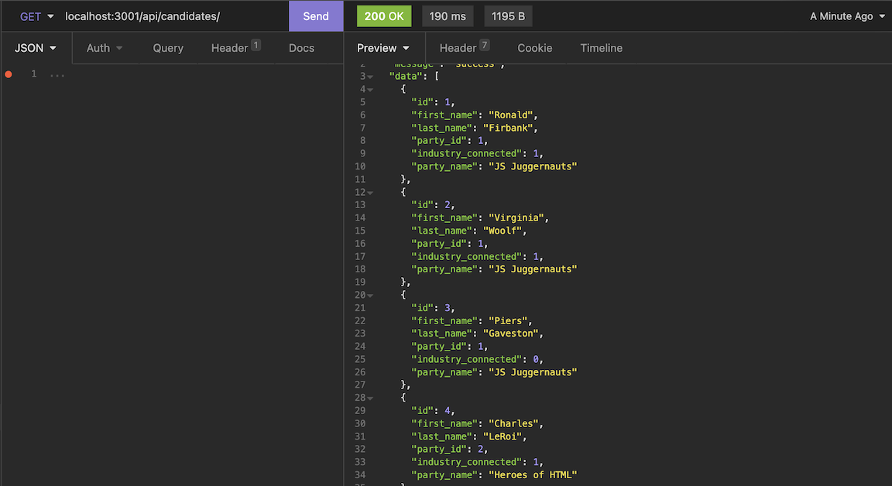

# U-Develop-It

## Description

U-Develop-It is the backend of a voting application created using express.js and MySQL. The application creates models for Candidates, Parties, and Voters, containing all of the necessary information needed to hold an official election. 

## Table of Contents

- [Installation](#Installation)
- [Usage](#Usage)
- [License](#License)
- [Questions](#Questions)

## Installation

Clone the repository to your local machine. Run the command `npm i` to install the local dependencies needed for this project.

In a separate tab, run the command `mysql -u root -p` and enter your password to log into MySQL. Next we need to source the database, so first run `source db/db.sql` which deletes any old exisiting database for this project and creates a fresh one. Next run `source db/schema.sql` which creates the necessary databases. Lastly the command `source db/seeds.sql` is optional, and by running it the application is filled with dummy data to allow the user to play around with the database or make any tests. 

## Usage

With MySQL still open, you must select the database you will be running. The database is called `election`. The command `show databases` can be used to show all the available databases a user can connect to. To select the election database, run  `use election`n

From the root folder of this repository, run the command `node server.js` or `npm start`. Access the website through your local host where all the functionality is available and data is saved. The routes and methods in this application can all be tested using Insomnia or another API client.

   
   
   
   

## License

A short and simple permissive license with conditions only requiring preservation of copyright and license notices. Licensed works, modifications, and larger works may be distributed under different terms and without source code.

## Questions

If you have any questions, concerns, or comments, feel free to contact me:

-GitHub: [Zacharycampanelli](https://github.com/Zacharycampanelli)  
-Email: [zaccamp@optonline.net](mailto:zaccamp@optonline.net)

